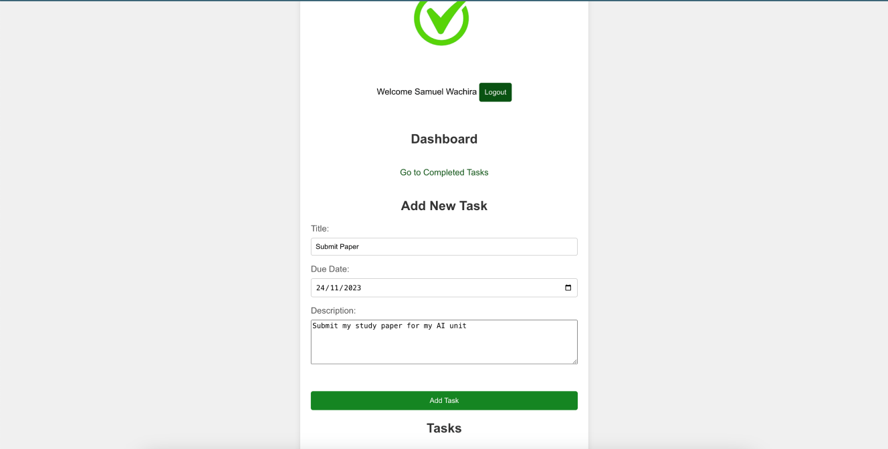
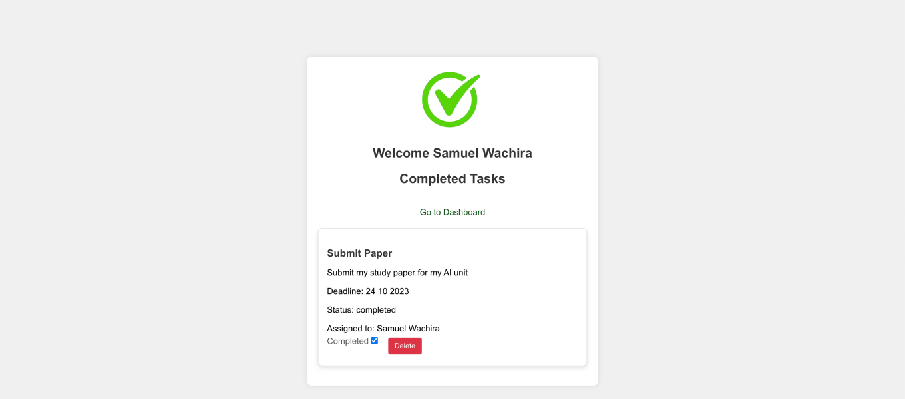
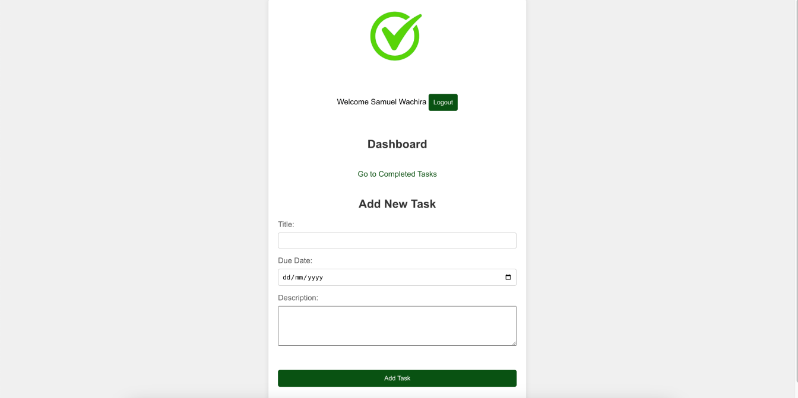
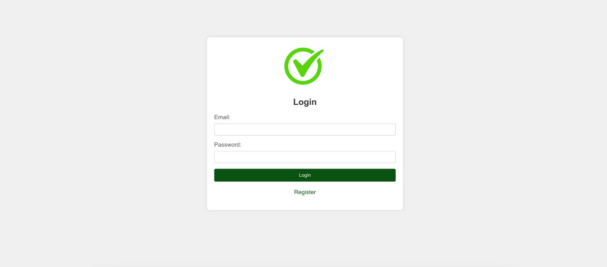
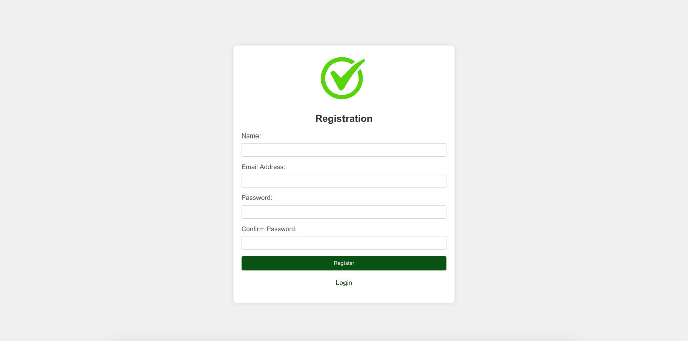
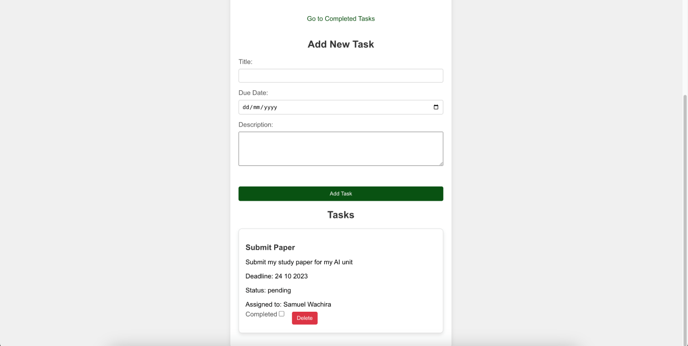

# Documentation of the Task Manager Application

This project was a task for Week 10 Experiment

### Link to Project Deployment

View an Implementation here [https://tasks.bigbolddesign.com/](https://tasks.bigbolddesign.com/)

## Features

### Manage Accounts

- Register
- Login

### Manage Tasks

- Add Task
- View task
- Delete Task
- Mark Task As Completed
- View Completd Tasks

## Setting Up

In the project directory, you can run:

### `npm install`

Installs the necessary modules. Make sure you have nodejs installed
Open [http://localhost:3000](http://localhost:3000) to view it in your browser.

### `npm start`

Runs the app in the development mode.\
Open [http://localhost:3000](http://localhost:3000) to view it in your browser.

The page will reload when you make changes.\
You may also see any lint errors in the console.

### App Screenshots

#### Add Task Page

#### Completed Tasks

#### Dashboard

#### Login Page

#### Registration Page

#### View tasks page
